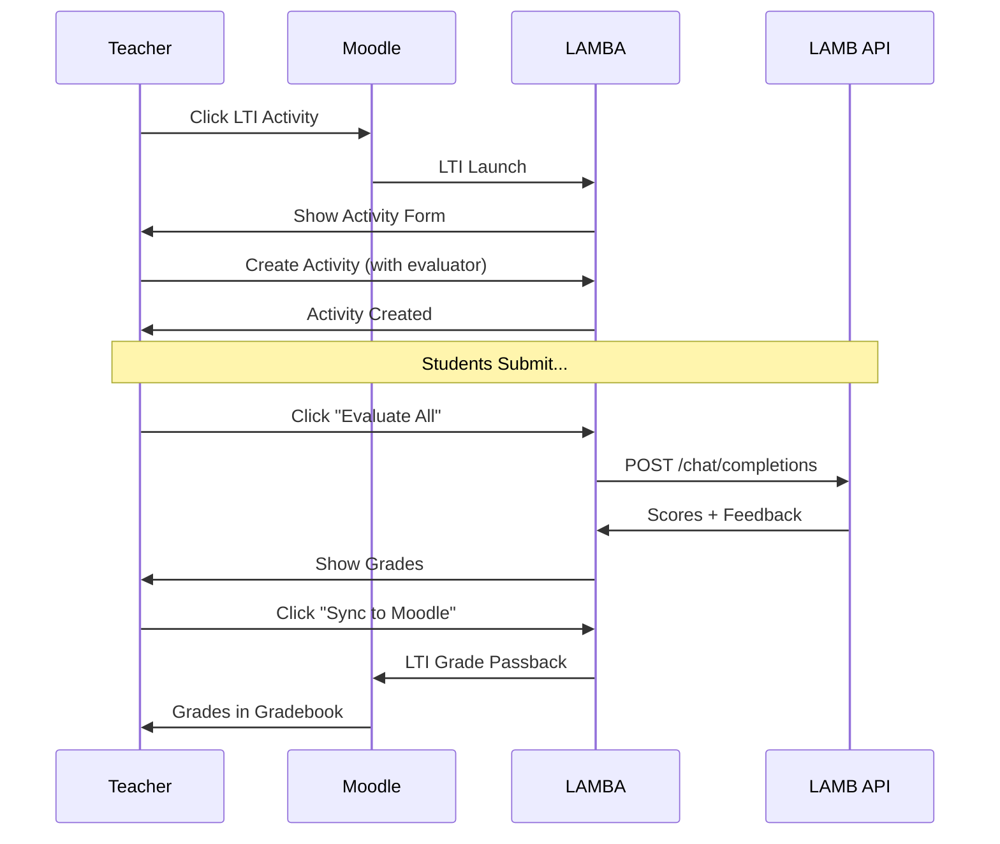
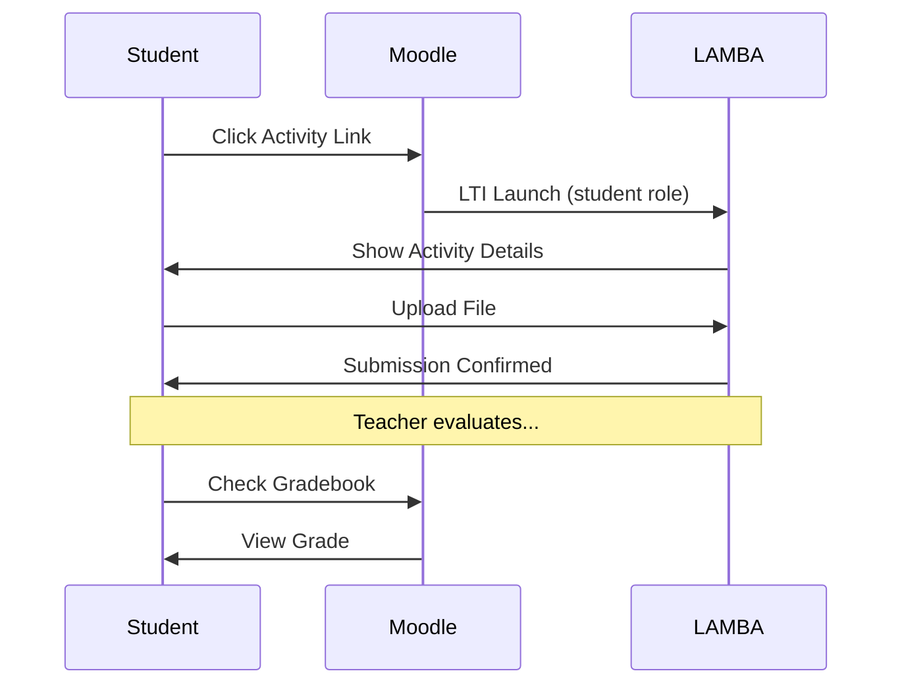
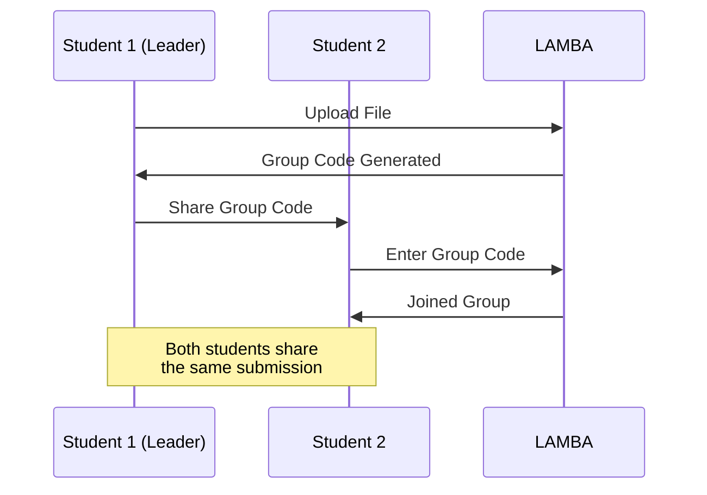

# LAMBA - Product Requirements Document (PRD)

## Document Information

| Field | Value |
|-------|-------|
| **Project Name** | LAMBA - Learning Activities & Machine-Based Assessment |
| **Version** | 1.0.0 |
| **Last Updated** | January 2026 |
| **Status** | Active Development |
| **Authors** | Arnau Tajahuerce, Marc Alier (UPC), Maria José Casañ (UPC), Juanan Pereira (UPV/EHU) |

---

## 1. Executive Summary

### 1.1 Product Vision

LAMBA is an LTI (Learning Tools Interoperability) external tool designed to bridge the gap between Learning Management Systems (LMS) like Moodle and AI-powered assessment capabilities provided by the LAMB platform. It enables educators to create, manage, and automatically evaluate educational activities with minimal technical overhead while maintaining seamless integration with existing institutional infrastructure.

### 1.2 Problem Statement

Educational institutions face several challenges:

1. **Manual Assessment Burden**: Teachers spend excessive time grading repetitive assignments
2. **Inconsistent Feedback**: Human evaluation varies in consistency and depth
3. **Delayed Feedback Cycles**: Students wait extended periods for assessment results
4. **LMS Limitations**: Most LMS platforms lack native AI-powered assessment capabilities
5. **Integration Complexity**: Connecting AI tools with institutional systems requires technical expertise

### 1.3 Solution Overview

LAMBA provides a turnkey solution that:

- Integrates seamlessly with Moodle via LTI 1.1
- Leverages LAMB's AI assistants for automated evaluation
- Supports both individual and group submissions
- Automatically synchronizes grades back to the LMS gradebook
- Offers a multilingual interface (Catalan, Spanish, English)

---

## 2. Product Goals & Objectives

### 2.1 Primary Goals

| Goal | Description | Success Metric |
|------|-------------|----------------|
| **G1** | Reduce teacher grading workload | 50% reduction in time spent on routine assessments |
| **G2** | Accelerate feedback delivery | Feedback within minutes instead of days |
| **G3** | Maintain assessment consistency | AI-powered evaluation with standardized rubrics |
| **G4** | Seamless LMS integration | Zero-friction deployment via LTI |

### 2.2 User-Centric Objectives

1. **For Teachers/Administrators**:
   - Create activities in under 2 minutes
   - Configure AI evaluators without technical knowledge
   - Review and override AI assessments when needed
   - Sync grades to Moodle with one click

2. **For Students**:
   - Submit assignments without leaving Moodle context
   - Receive immediate AI-generated feedback
   - Collaborate in groups with shared submission codes
   - View grades directly in Moodle gradebook

---

## 3. Target Users & Personas

### 3.1 Primary Users

#### Persona 1: Teacher/Instructor (Ana)

| Attribute | Description |
|-----------|-------------|
| **Role** | University Professor |
| **Goals** | Efficient grading, consistent feedback, more time for teaching |
| **Pain Points** | Grading 100+ assignments per week, delayed feedback to students |
| **Technical Level** | Basic - comfortable with Moodle, not a developer |

#### Persona 2: Student (Carlos)

| Attribute | Description |
|-----------|-------------|
| **Role** | Undergraduate Student |
| **Goals** | Quick feedback, clear grades, easy submission process |
| **Pain Points** | Waiting weeks for grades, unclear assessment criteria |
| **Technical Level** | Basic - uses LMS for coursework |

#### Persona 3: System Administrator (Elena)

| Attribute | Description |
|-----------|-------------|
| **Role** | IT Administrator |
| **Goals** | Easy deployment, minimal maintenance, security compliance |
| **Pain Points** | Complex integrations, security risks, support burden |
| **Technical Level** | Advanced - manages institutional infrastructure |

### 3.2 Secondary Users

- **Course Coordinators**: Monitor activity across multiple sections
- **Teaching Assistants**: Assist with grading and submission management
- **Institution Administrators**: Access analytics and usage metrics

---

## 4. Functional Requirements

### 4.1 Core Features

#### 4.1.1 LTI Integration (FR-LTI)

| ID | Requirement | Priority | Status |
|----|-------------|----------|--------|
| FR-LTI-01 | Support LTI 1.1 launch from Moodle | P0 | ✅ Implemented |
| FR-LTI-02 | Automatic user provisioning from LTI context | P0 | ✅ Implemented |
| FR-LTI-03 | Course and activity context mapping | P0 | ✅ Implemented |
| FR-LTI-04 | Grade passback via LTI Outcome Service | P0 | ✅ Implemented |
| FR-LTI-05 | Role-based access (instructor/student) | P0 | ✅ Implemented |

#### 4.1.2 Activity Management (FR-ACT)

| ID | Requirement | Priority | Status |
|----|-------------|----------|--------|
| FR-ACT-01 | Create individual activities | P0 | ✅ Implemented |
| FR-ACT-02 | Create group activities with configurable size | P0 | ✅ Implemented |
| FR-ACT-03 | Set activity deadlines | P1 | ✅ Implemented |
| FR-ACT-04 | Assign LAMB evaluator to activity | P0 | ✅ Implemented |
| FR-ACT-05 | Edit activity description and settings | P1 | ✅ Implemented |
| FR-ACT-06 | View all submissions for an activity | P0 | ✅ Implemented |

#### 4.1.3 Submission Management (FR-SUB)

| ID | Requirement | Priority | Status |
|----|-------------|----------|--------|
| FR-SUB-01 | File upload for submissions (PDF, DOCX, TXT) | P0 | ✅ Implemented |
| FR-SUB-02 | Maximum file size limit (50MB) | P1 | ✅ Implemented |
| FR-SUB-03 | Group code generation for group activities | P0 | ✅ Implemented |
| FR-SUB-04 | Join group using shared code | P0 | ✅ Implemented |
| FR-SUB-05 | View group members | P1 | ✅ Implemented |
| FR-SUB-06 | Update submission (before grading) | P2 | ✅ Implemented |

#### 4.1.4 Assessment & Grading (FR-GRD)

| ID | Requirement | Priority | Status |
|----|-------------|----------|--------|
| FR-GRD-01 | Automatic evaluation via LAMB API | P0 | ✅ Implemented |
| FR-GRD-02 | Manual grade entry/override | P0 | ✅ Implemented |
| FR-GRD-03 | Batch evaluation of all submissions | P1 | ✅ Implemented |
| FR-GRD-04 | Sync grades to Moodle | P0 | ✅ Implemented |
| FR-GRD-05 | Grade normalization (0-10 to 0-1) | P0 | ✅ Implemented |
| FR-GRD-06 | Include feedback comments | P1 | ✅ Implemented |

#### 4.1.5 Administration (FR-ADM)

| ID | Requirement | Priority | Status |
|----|-------------|----------|--------|
| FR-ADM-01 | Admin authentication (username/password) | P0 | ✅ Implemented |
| FR-ADM-02 | Dashboard with global statistics | P1 | ✅ Implemented |
| FR-ADM-03 | View all Moodle instances | P2 | ✅ Implemented |
| FR-ADM-04 | View all courses/activities/users | P2 | ✅ Implemented |
| FR-ADM-05 | View all submissions/grades | P2 | ✅ Implemented |

### 4.2 User Interface Requirements

#### 4.2.1 Student Interface

- Activity information display (title, description, deadline)
- File upload component with drag-and-drop support
- Group code input for joining groups
- Submission status indicator
- Grade and feedback display (when available)

#### 4.2.2 Teacher Interface

- Activity creation form with all parameters
- Submissions list with download capability
- Bulk evaluation trigger
- Grade synchronization control
- Activity editing capabilities

#### 4.2.3 Admin Interface

- Login screen with credential validation
- Dashboard with key metrics
- Data tables for all entities
- Navigation sidebar

### 4.3 Internationalization (FR-I18N)

| ID | Requirement | Priority | Status |
|----|-------------|----------|--------|
| FR-I18N-01 | Support for Catalan (ca) | P1 | ✅ Implemented |
| FR-I18N-02 | Support for Spanish (es) | P1 | ✅ Implemented |
| FR-I18N-03 | Support for English (en) | P1 | ✅ Implemented |
| FR-I18N-04 | Language selector in UI | P2 | ✅ Implemented |
| FR-I18N-05 | Date/time localization | P2 | ✅ Implemented |

---

## 5. Non-Functional Requirements

### 5.1 Performance

| ID | Requirement | Target |
|----|-------------|--------|
| NFR-PERF-01 | Page load time | < 2 seconds |
| NFR-PERF-02 | API response time (non-evaluation) | < 500ms |
| NFR-PERF-03 | Evaluation response time | < 30 seconds (configurable) |
| NFR-PERF-04 | Concurrent users supported | 100+ |
| NFR-PERF-05 | File upload throughput | 50MB files |

### 5.2 Security

| ID | Requirement | Implementation |
|----|-------------|----------------|
| NFR-SEC-01 | HTTPS support | SSL/TLS certificates |
| NFR-SEC-02 | Session management | HTTP-only cookies |
| NFR-SEC-03 | OAuth 1.0a for LTI | HMAC-SHA1 signatures |
| NFR-SEC-04 | File path traversal prevention | Path validation |
| NFR-SEC-05 | Admin authentication | Password-protected access |

### 5.3 Reliability

| ID | Requirement | Target |
|----|-------------|--------|
| NFR-REL-01 | System availability | 99.5% uptime |
| NFR-REL-02 | Data persistence | SQLite with backup capability |
| NFR-REL-03 | Error handling | Graceful degradation |
| NFR-REL-04 | Logging | Comprehensive application logs |

### 5.4 Usability

| ID | Requirement | Implementation |
|----|-------------|----------------|
| NFR-USA-01 | Responsive design | Mobile-first approach |
| NFR-USA-02 | Accessibility | WCAG 2.1 guidelines |
| NFR-USA-03 | Intuitive navigation | Minimal clicks to complete tasks |
| NFR-USA-04 | Error messages | Clear, actionable feedback |

### 5.5 Maintainability

| ID | Requirement | Implementation |
|----|-------------|----------------|
| NFR-MNT-01 | Modular architecture | Service-based design |
| NFR-MNT-02 | Code documentation | Inline comments + API docs |
| NFR-MNT-03 | Test coverage | Unit and integration tests |
| NFR-MNT-04 | Configuration management | Environment variables |

---

## 6. Integration Requirements

### 6.1 LAMB Platform Integration

LAMBA connects to the LAMB platform for AI-powered evaluation:

```
LAMBA → LAMB API (/v1/models, /chat/completions)
         ↓
    AI Evaluation
         ↓
    Score + Feedback
```

**Configuration**:
- `LAMB_API_URL`: LAMB server endpoint
- `LAMB_BEARER_TOKEN`: Authentication token
- `LAMB_TIMEOUT`: Request timeout (default: 30s)

**Evaluation Flow**:
1. Extract text from submitted document
2. Send text to configured LAMB evaluator model
3. Parse response for "NOTA FINAL: X.X" or "FINAL SCORE: X.X"
4. Store grade and feedback

### 6.2 Moodle LTI Integration

**LTI 1.1 Parameters Used**:

| Parameter | Purpose |
|-----------|---------|
| `user_id` | Student/teacher identification |
| `roles` | Permission determination |
| `context_id` | Course identification |
| `resource_link_id` | Activity identification |
| `lis_result_sourcedid` | Grade passback identifier |
| `lis_outcome_service_url` | Grade submission endpoint |
| `tool_consumer_instance_guid` | Moodle instance ID |

**Grade Passback Process**:
1. Build LTI Outcome XML request
2. Calculate OAuth body hash
3. Generate OAuth signature
4. POST to Moodle's outcome service URL
5. Parse response for success/failure

---

## 7. Data Requirements

### 7.1 Data Entities

| Entity | Description | Key Fields |
|--------|-------------|------------|
| **MoodleInstance** | LMS installation | id, name, outcome_url |
| **User** | Student or teacher | id, moodle_id, name, email, role |
| **Course** | Academic course | id, moodle_id, title |
| **Activity** | Assignment/task | id, title, type, deadline, evaluator_id |
| **FileSubmission** | Uploaded document | id, file_path, group_code |
| **StudentSubmission** | Student participation | id, student_id, lis_sourcedid |
| **Grade** | Assessment result | id, score, comment |

### 7.2 Data Relationships

```
MoodleInstance
    ├── Users (1:N)
    └── Courses (1:N)
            └── Activities (1:N)
                    └── StudentSubmissions (1:N)
                            └── FileSubmission (N:1)
                                    └── Grade (1:1)
```

### 7.3 File Storage

**Directory Structure**:
```
uploads/
└── {moodle_id}/
    └── {course_id}/
        └── {activity_id}/
            └── {submission_id}/
                └── filename.ext
```

---

## 8. User Workflows

### 8.1 Teacher: Create and Grade Activity



### 8.2 Student: Individual Submission



### 8.3 Student: Group Submission



---

## 9. Acceptance Criteria

### 9.1 Activity Creation

- [ ] Teacher can create individual activity with title, description
- [ ] Teacher can create group activity with max size (≥2)
- [ ] Teacher can set optional deadline
- [ ] Teacher can assign LAMB evaluator ID
- [ ] Activity is linked to LTI resource_link_id

### 9.2 Student Submission

- [ ] Student can upload PDF, DOCX, or TXT file
- [ ] File size limited to 50MB
- [ ] Student receives confirmation with file details
- [ ] For groups: code is generated and displayed
- [ ] For groups: other students can join with code

### 9.3 Evaluation

- [ ] Teacher can trigger automatic evaluation
- [ ] LAMB API is called with document text
- [ ] Score (0-10) is parsed from response
- [ ] Feedback comment is stored
- [ ] Teacher can manually override grade

### 9.4 Grade Sync

- [ ] Grades are normalized to 0-1 for Moodle
- [ ] LTI Outcome Service is called correctly
- [ ] Success/failure is reported to teacher
- [ ] Student sees grade in Moodle gradebook

---

## 10. Success Metrics

### 10.1 Adoption Metrics

| Metric | Target | Measurement |
|--------|--------|-------------|
| Active Moodle instances | 10+ | Count of unique tool_consumer_instance_guid |
| Activities created | 100+ | Database count |
| Submissions processed | 1000+ | Database count |
| AI evaluations performed | 500+ | API call logs |

### 10.2 Performance Metrics

| Metric | Target | Measurement |
|--------|--------|-------------|
| Average evaluation time | < 15s | API response times |
| Grade sync success rate | > 99% | Success/total ratio |
| System uptime | > 99.5% | Monitoring |

### 10.3 User Satisfaction

| Metric | Target | Measurement |
|--------|--------|-------------|
| Teacher satisfaction | > 4/5 | Survey |
| Student satisfaction | > 4/5 | Survey |
| Support tickets | < 10/month | Ticket tracking |

---

## 11. Risks & Mitigations

| Risk | Impact | Probability | Mitigation |
|------|--------|-------------|------------|
| LAMB API unavailable | High | Low | Graceful degradation, manual grading fallback |
| LTI credential mismatch | Medium | Medium | Clear setup documentation, validation |
| Large file uploads | Medium | Medium | Size limits, async processing |
| Cross-institution data isolation | High | Low | Composite keys, multi-tenant design |
| AI evaluation inaccuracy | Medium | Medium | Teacher override capability |

---

## 12. Future Roadmap

### Phase 2 (Planned)

- [ ] LTI 1.3 / LTI Advantage support
- [ ] Multiple file submissions per activity
- [ ] Rubric-based manual grading interface
- [ ] Student self-assessment before AI evaluation
- [ ] Plagiarism detection integration

### Phase 3 (Planned)

- [ ] Analytics dashboard for teachers
- [ ] Learning analytics for institutions
- [ ] Custom evaluator prompt templates
- [ ] Peer review workflows
- [ ] Integration with other LMS (Canvas, Blackboard)

---

## 13. Glossary

| Term | Definition |
|------|------------|
| **LTI** | Learning Tools Interoperability - standard for LMS integration |
| **LAMB** | Multi-tenant AI assistant platform for education |
| **LAMBA** | This product - Learning Activities & Machine-Based Assessment |
| **LMS** | Learning Management System (e.g., Moodle) |
| **Evaluator** | LAMB AI assistant configured for assessment |
| **Grade Passback** | LTI mechanism to send grades to LMS |
| **Group Code** | 8-character code for joining group submissions |

---

## 14. References

- [LTI 1.1 Specification](https://www.imsglobal.org/specs/ltiv1p1)
- [Moodle External Tool Documentation](https://docs.moodle.org/en/External_tool)
- [LAMB Project Documentation](https://lamb-project.org)
- [FastAPI Documentation](https://fastapi.tiangolo.com)
- [SvelteKit Documentation](https://kit.svelte.dev)
